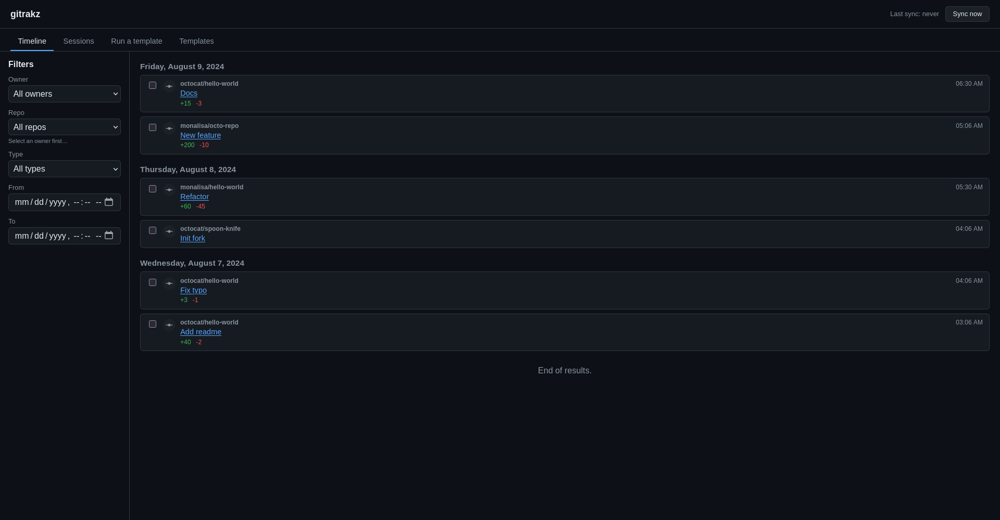
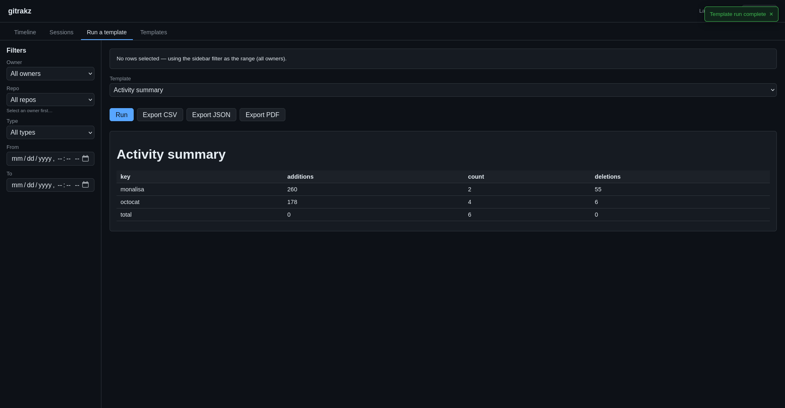

# gitrakz

[](https://github.com/psyb0t/gitrakz/actions/workflows/pipeline.yml)
[](https://github.com/psyb0t/gitrakz/actions/workflows/pipeline.yml)
[](https://github.com/psyb0t/gitrakz/releases)
[](LICENSE)
[](https://hub.docker.com/r/psyb0t/gitrakz)

Self-hosted GitHub activity tracker: it syncs your `gh` activity into a local SQLite database, renders a filterable timeline and derived work sessions, and runs **programmatic templates** — deterministic transform pipelines composed onto typed display blocks — that export to CSV, PDF, or JSON. A single Go binary with the Svelte UI embedded in it; no external services required.



A template is not a saved prompt — it is a saved **composition**: a form, a transform pipeline over the timeline, and a display layout. The pipeline is deterministic; the LLM (optional) only *composes* a template from the building blocks or narrates a single prose block. Everything you see is one of a fixed set of renderers.



## Contents

- [Features](#features)
- [How it works](#how-it-works)
- [Quickstart](#quickstart)
- [Configuration](#configuration)
- [Building blocks and templates](#building-blocks-and-templates)
- [HTTP API](#http-api)
- [Development](#development)
- [Security notes](#security-notes)
- [License](#license)

## Features

- **Timeline** — every commit / PR / review / issue / release for a GitHub user, grouped by day, with owner/repo, title, `+additions/-deletions`, time and link. Filter by owner, repo, type and date range; paginated with `hasMore` (never a `total` count).
- **Sessions** — derived, not stored: events are grouped per owner and split into work sessions whenever the idle gap exceeds `GITRAKZ_SESSION_GAP`, with a configurable lead-in so pre-first-commit work is counted. The grounding for timesheet-style reports.
- **Templates** — built-in and custom. A template = `{ form, transform, layout, exports }`. Run one over a filtered range and get a typed block document you can export. Built-ins ship ready to run; custom ones are created, edited (built-ins clone-on-edit) or **LLM-composed** from a plain-language description.
- **Deterministic transforms** — a fixed library of primitives (`sessionize`, `exclude-off-time`, `split-by-active-days`, `group-by`, `aggregate`, `rate`, `passthrough`) plus one LLM-backed step (`describe-work`) whose output is cached in the DB by prompt/config version so a re-run costs nothing.
- **Typed display blocks** — `heading`, `text`, `table`, `metric`, `keyvalue`, `list`, `code`, `chart`. One renderer per block, in the SPA and in every exporter.
- **Exports** — CSV, JSON and PDF of any document or template run.
- **Embedded Svelte SPA** — the UI is compiled into the binary. Shareable deep-link runs: `/?tpl=<id>&run=1`.
- **Single static binary or a small Docker image** — pure-Go SQLite (no cgo), migrations embedded, sync on a background ticker.
- **LLM-optional** — `describe-work`, `text` prose blocks and "generate a template with AI" go through [`elelem`](https://github.com/psyb0t/elelem), selecting an `openai` (or OpenAI-compatible) or `anthropic` provider by env. Leave the provider config empty and everything deterministic still works.

## How it works

```
gh CLI ──sync──▶ SQLite (events) ──▶ timeline / sessions
                                 └──▶ template = form + transform pipeline + layout
                                              └──▶ typed block document ──▶ SPA / CSV / PDF / JSON
```

`gitrakz` shells out to the GitHub `gh` CLI to discover a user's repos and pull their activity incrementally — per-repo and fail-soft, so one rate-limited repo never aborts the rest — persisting events into SQLite. A run resolves a template, queries the filtered timeline, runs the transform pipeline deterministically, maps the result onto the display layout, and returns the block document.

## Quickstart

### Docker

```bash
docker run --rm -p 8080:8080 \
  -e GITRAKZ_GH_USER=your-github-username \
  -e GITRAKZ_DB_PATH=/data/gitrakz.db \
  -v gitrakz-data:/data \
  -v "$HOME/.config/gh:/root/.config/gh:ro" \
  psyb0t/gitrakz:latest
```

Then open <http://localhost:8080>. `gitrakz` uses the mounted `gh` credentials to sync; trigger one from the UI ("Sync now") or wait for the background ticker.

### From source

```bash
git clone https://github.com/psyb0t/gitrakz
cd gitrakz
make build                          # static binary in ./build (via Docker)
GITRAKZ_GH_USER=your-username ./build/gitrakz run
```

Local dev without Docker:

```bash
cd web && pnpm install && pnpm build && cd ..   # build the embedded SPA
GITRAKZ_GH_USER=your-username go run ./cmd run
```

`gh` must be installed and authenticated (`gh auth login`) wherever the binary runs.

## Configuration

All configuration is environment variables, prefixed `GITRAKZ_`. `GITRAKZ_GH_USER` is required; everything else has a sane default.

| Variable | Default | What it does |
|---|---|---|
| `GITRAKZ_GH_USER` | *(required)* | The GitHub user whose activity is tracked. |
| `GITRAKZ_HTTP_ADDR` | `:8080` | Listen address for the HTTP server + embedded SPA. |
| `GITRAKZ_AUTH_TOKEN` | *(empty)* | When set, `/api` requires `Authorization: Bearer <token>`. Empty = open (single-user / trusted network). |
| `GITRAKZ_DB_PATH` | `/data/gitrakz.db` | SQLite file. Migrations run on boot. |
| `GITRAKZ_SYNC_SINCE` | `2025-01-01` | Earliest activity to pull on a first sync. |
| `GITRAKZ_SYNC_INTERVAL` | `30m` | Background incremental-sync cadence. |
| `GITRAKZ_SESSION_GAP` | `30m` | Idle gap that starts a new work session. |
| `GITRAKZ_SESSION_LEADIN` | `25m` | Padding added before a session's first event (pre-commit work). |
| `GITRAKZ_ELELEM_TYPE` | `openai` | LLM provider driver — `openai` (also any OpenAI-compatible endpoint) or `anthropic`. |
| `GITRAKZ_ELELEM_BASE_URL` | *(empty)* | API host for the provider, used by `describe-work`, prose blocks and template generation. |
| `GITRAKZ_ELELEM_MODEL` | *(empty)* | Model name for the LLM endpoint. |
| `GITRAKZ_ELELEM_API_KEY` | *(empty)* | API key for the LLM endpoint. |

Logging follows the standard `LOG_LEVEL` / `LOG_FORMAT` / `LOG_ADD_SOURCE` env vars. Every request is logged with a `requestId` that the SPA also echoes to the browser console, so a full request reconstructs across both sides.

## Building blocks and templates

A template is programmatic and has three parts, composed from two fixed libraries:

```
template = { id, name, description,
             form,       // input fields a run collects (rate, lead-in, off-hours…)
             transform,  // ordered pipeline of transform primitives (deterministic)
             layout,     // display-block composition rendering the transform output
             exports }   // [csv, pdf, json]
```

**Transform primitives** (compute over the timeline): `sessionize`, `exclude-off-time`, `split-by-active-days`, `group-by`, `aggregate`, `rate`, `passthrough`, and the LLM-backed `describe-work` (cached in the DB by prompt/config version).

**Display blocks** (render the result): `heading`, `text`, `list`, `table`, `keyvalue`, `metric`, `code`, `chart`.

Ships with built-in templates — *Activity summary*, *Commits per repo*, and a *Work sessions timesheet* — and "Generate with AI" turns a description into a draft template you review and save. No raw HTML or code is ever authored by hand.

## HTTP API

Everything the SPA does is a REST call under `/api/v1` (JSON, camelCase), behind `GITRAKZ_AUTH_TOKEN` when set. The `/api/v1` prefix lives in the spec's `servers:` block; the paths are version-less there.

```
GET  /                           # the embedded Svelte SPA
GET  /api/v1/owners              # distinct owners
GET  /api/v1/repos?owner=        # repos under an owner
GET  /api/v1/timeline?owner=&repo=&type=&from=&to=&page=&perPage=
GET  /api/v1/sessions?…          # sessionized view + heuristic hours
POST /api/v1/sync                # trigger an incremental sync
GET  /api/v1/sync/status         # last sync status
GET  /api/v1/templates           # list (built-in + custom)
POST /api/v1/templates           # create a custom template
PUT  /api/v1/templates/{id}      # edit (built-ins clone-on-edit)
DELETE /api/v1/templates/{id}    # delete a custom template
POST /api/v1/templates/generate  # LLM-compose a template draft from a description
POST /api/v1/run                 # run a template over a filter -> block document (JSON)
POST /api/v1/export              # export a document / run to csv|pdf|json
```

The OpenAPI spec at `api/api.yml` is the source of truth; the server interface and types are generated from it.

## Development

```bash
make lint            # golangci-lint (80+ linters) + go fix diff
make test            # go test -race ./...
make test-coverage   # 90% gate (excludes generated code, /cmd and services)
make build           # static binary via Docker
make run-dev         # run in the dev container
```

Stack: Go on [`servicepack`](https://github.com/psyb0t/servicepack) · HTTP via [`aichteeteapee`](https://github.com/psyb0t/aichteeteapee) `serbewr` + `oapi-codegen` strict server · SQLite via `gorm` + `gorm-gen` (schema owned by embedded SQL migrations, never AutoMigrate) · LLM via [`elelem`](https://github.com/psyb0t/elelem) · `gh` shell-out via [`commander`](https://github.com/psyb0t/commander) · Svelte 5 + Vite SPA embedded with `go:embed`.

Project layout follows [golang-standards/project-layout](https://github.com/golang-standards/project-layout): `cmd/` entrypoints, `internal/pkg/http/{api,server}` (generated API + handlers), `internal/pkg/services/http-server` (the servicepack service), `internal/pkg/db/{models,repositories,migrations}`, `internal/pkg/transform/*` and `internal/pkg/common/*`, `web/` for the SPA.

See [CHANGELOG.md](CHANGELOG.md) for release notes.

## Security notes

- `gitrakz` runs the `gh` CLI with whatever credentials it's given — mount a read-scoped token; it only reads activity.
- Set `GITRAKZ_AUTH_TOKEN` for anything beyond a trusted single-user network; without it the API is open.
- Point `GITRAKZ_ELELEM_BASE_URL` only at endpoints you control or trust — `describe-work` and template generation send commit titles / diffs there.
- The SPA renders markdown without raw-HTML injection; template output is typed blocks, never author-supplied HTML.

## License

MIT — see [LICENSE](LICENSE).

---

*Built with spite using [servicepack](https://github.com/psyb0t/servicepack).*
